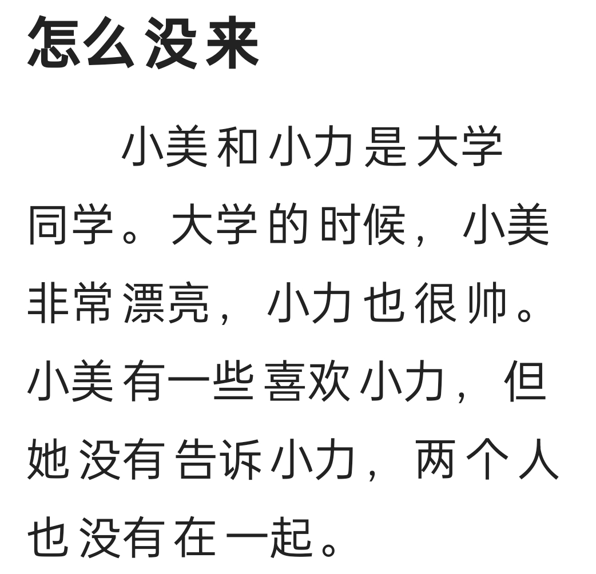
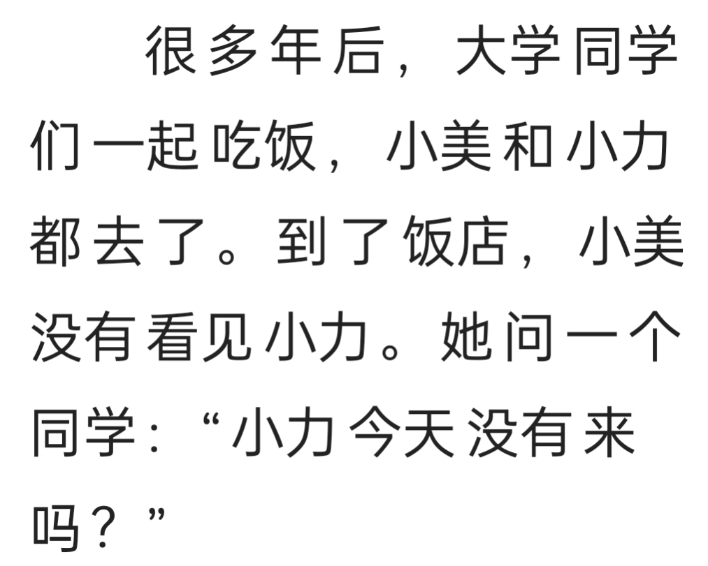
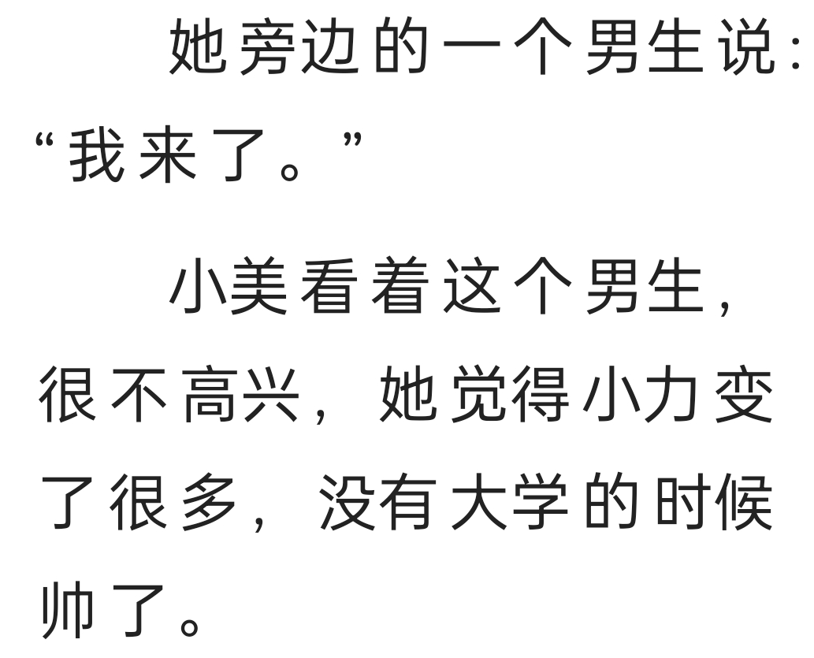
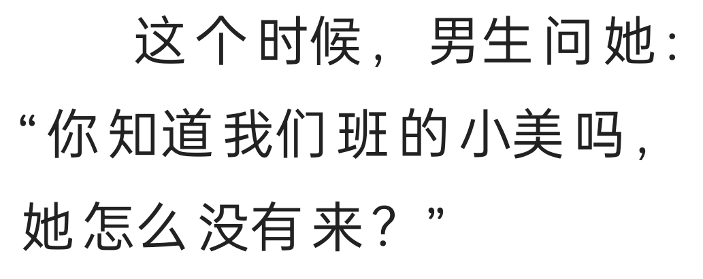

# Материалы по изучению китайского языка

[Поиск перевода иероглифа](https://cidian.ru/) по рукописной картинке.

Материалы для перевода микро-рассказа "怎么没来", источник - приложение "HelloChineese"

- 怎么 = why, how
- 没 = Méi = not
- 来 = Lái = come, arrive, show up

## Главные герои:

- 小美 = Xiǎo Měi. _Исходя из текста, это девочка_.
- 小力 = Xiǎo Lì.  _Исходя из текста, это мальчик_.

- 小 = Xiǎo = маленький
- 力 = Lì = force, power, strength

## Слова, связанные со школой (学):

- 学生 = Xué shēng = student, pupil
- 学校 = Xué xiào = school
- 同学 = Tóng xué = classmate
- 大学 = Dà xué = college
- 学问 = Xué wèn = learning, knowledge
- 放学 = Fàng xué = After school

- 大学 的 时候 = in college

Ключевой иероглиф - 学, т.е. указывает на отношение к школе.

- 帅 = shuài = предводитель, видный, солидный. Handsome
- 大 = Dà = large, big, great, major
- 班 = Bān = class, урок
- 男生 = Nán shēng = boy
- 男朋友 = Nán péng yǒu = boyfriend
- 朋友 = Péng yǒu = friend
- 女朋友 = Nǚ péng yǒu = girlfriend

Иероглиф 男 указывает на мужской пол, а 女 - на женский. 朋友 означает "друг".

- 师 = Shī = division, разделение
- 老 = Lǎo = old, aged
- 老师 = Lǎo shī = teacher

## Часто используемые слова

- 一起 = Yī qǐ = together, in the same place
- 一些 = Yī xiē = some, a few, a little
- 饭厅 = Fàn tīng = столовая
- 但 = Dàn = but
- 告诉 = Gào sù = tell
- 去 = Qù = go
- 去了 = Qù le = went to
- 走 = Zǒu = walk
- 看 = Kàn = see, look, sight, notice, note
- 喜欢 = Xǐ huān = like, нравится
- 旁 = Páng = beside, next, nearby, рядом
- 觉得 = Juédé = feel

- 这个时候 = at this time

## Мой перевод

小美 и 小力 одноклассники в колледже. В коллеже, 小美 очень красивая, 小力 тоже видный. 小美 нравится 小力, но она не может сказать об этом 小力. Эти два человека не являются парой (не вместе).

Замечание: _帅 - не видный, а симпатичный. Это история о прошлом, а я перевёл, как настоящее. Где маркер прошлого времени?_

Больше года назад, одноклассники в колледже вместе ели еду, 小美 и 小力 оба пошли (去了). В столовой (饭厅) 小美 не увидела 小力. Она спросила одноклассника: "小力 сегодня не пришёл?"

Замечание: _"много лет после", а не "более года назад". Они оба ужинали и оба пришли._

Сидяший рядом с ней мальчик сказал: "Я пришёл". 小美 посмотрела на этого мальчика и он не был счастлив. Она почуствовала (觉得), что 小力 стал не такой handsome каким он был в колледже.

Замечание: _по смыслу не "Я пришёл", а "Я здесь".

В этой время (这个时候), мальчик спросил её: "Ты знаешь девочку 小美 из нашего класса? Почему она не пришла?"
